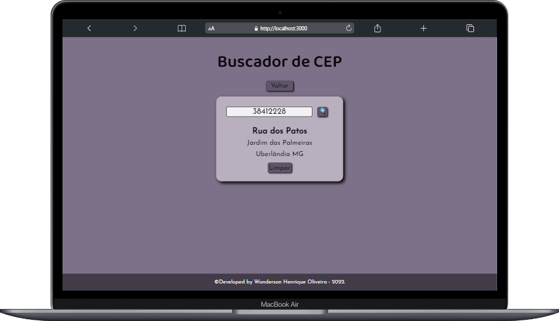
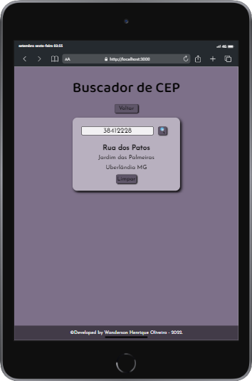
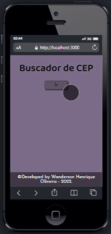

## 📬 Zip Code Finder 📬

<i>Projeto desenvolvido como desafio pessoal referente ao módulo 2 do curso Vai na Web de desenvolvimento front-end. </i>  

    
    
    
    

 

  A princípio nesse projeto, propus como objetivo trabalhar o conteúdo visto em aula. Porém, após concluído optei por incluir funcionalidades adicionais.

  Todos os parâmetros foram seguidos de acordo com a matéria proposta. O resultado final seguiu um padrão clean, otimizado e ao mesmo tempo consegui expressar minha personalidade no código.

  Conforme as necessidades se apresentarem, novas funções poderão ser incluídas no código.

## RECURSOS UTILIZADOS

  Este projeto foi desenvolvido em React JS utilizando uma API de códigos postais onde foram definidos parâmetros para que o mesmo filtrasse alguns dados específicos.
A estilização ficou por conta da biblioteca do Styled-Components e um conjunto de fontes importadas do Google Fonts. Paleta de cores criada por meio de variáveis conforme gosto pessoal do desenvolvedor.

## COMO FUNCIONA

  A aplicação conta com 3 botões funcionais onde foram aplicados os conhecimentos do hook useState, sendo o primeiro para habilitar um modal onde é apresentado um input para inserção do CEP, o segundo para iniciar a pesquisa após o termo ser digitado e por fim, o terceiro tem a função de limpar o input e os resultados da pesquisa.

## PREVIEW

  

  
  

 

    

